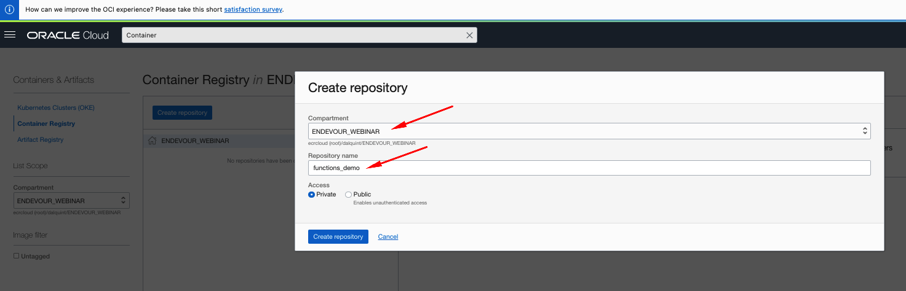
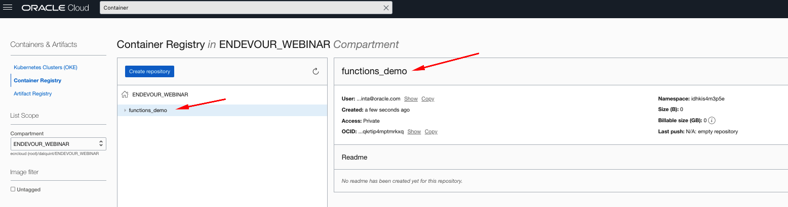
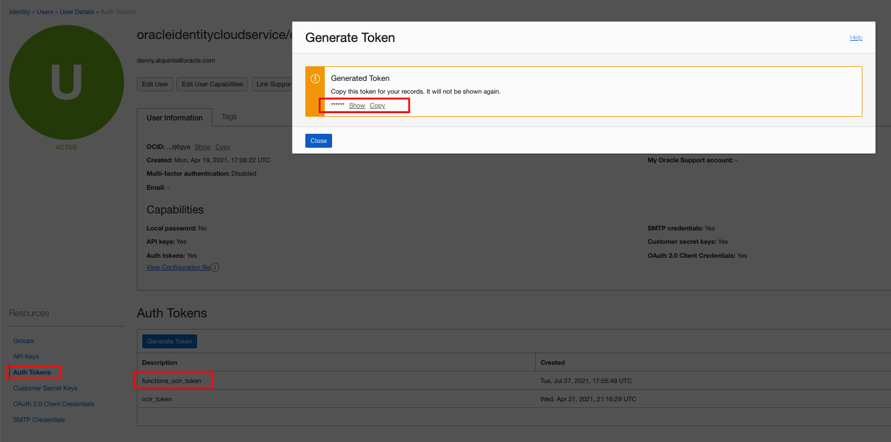
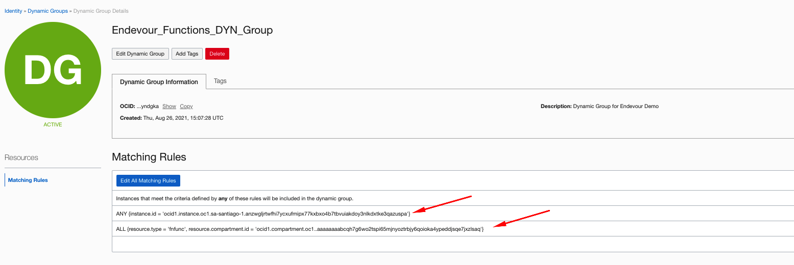
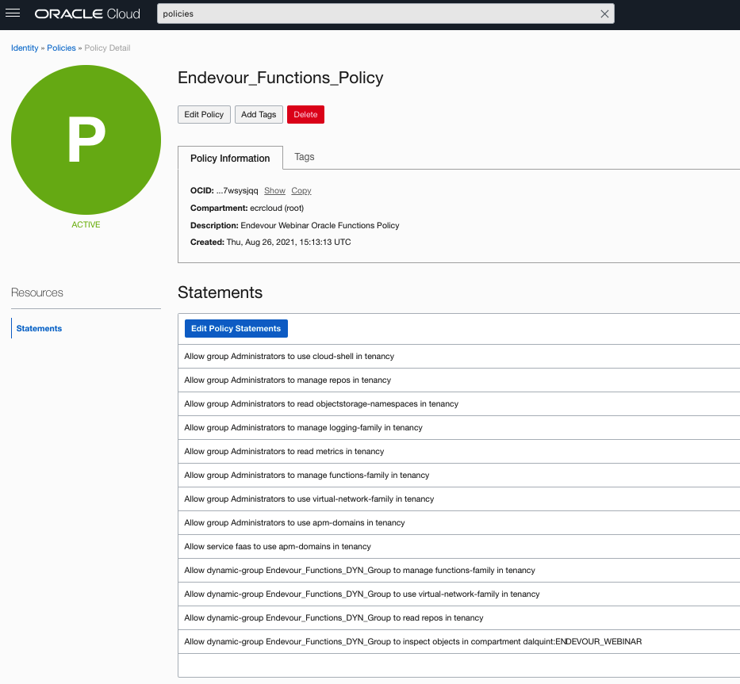
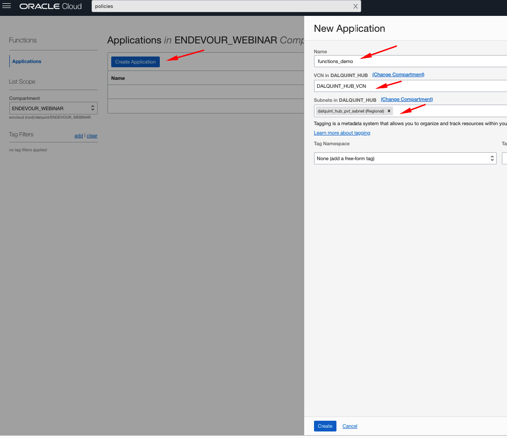
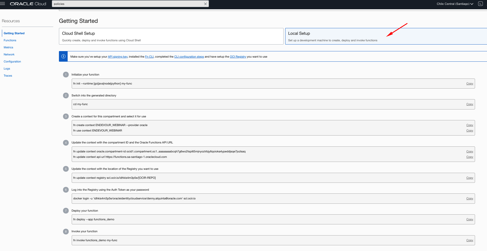

# Ejemplos Webinar Endevour - Oracle Functions

[](https://img.shields.io/badge/license-UPL-green) [](https://sonarcloud.io/dashboard?id=oracle-devrel_terraform-oci-cloudbricks-linux-compute)

## Example highlights

Setup is based on the [following link](https://docs.oracle.com/en-us/iaas/Content/Functions/Tasks/functionsquickstartocicomputeinstance.htm)


- Run script `setup_env.sh`
  Expected output: 

```shell
[opc@dalquintdevhubscl functions]$ ./setup_env.sh 
Loaded plugins: langpacks, ulninfo
Package oracle-epel-release-el7-1.0-4.el7.x86_64 already installed and latest version
Nothing to do
Loaded plugins: langpacks, ulninfo
Package python3-3.6.8-18.0.3.el7.x86_64 already installed and latest version
Nothing to do
Requirement already satisfied: virtualenv in /home/opc/.local/lib/python3.6/site-packages
Requirement already satisfied: opc in /home/opc/.local/lib/python3.6/site-packages
Requirement already satisfied: filelock<4,>=3.0.0 in /home/opc/.local/lib/python3.6/site-packages (from virtualenv)
Requirement already satisfied: distlib<1,>=0.3.1 in /home/opc/.local/lib/python3.6/site-packages (from virtualenv)
Requirement already satisfied: importlib-resources>=1.0; python_version < "3.7" in /home/opc/.local/lib/python3.6/site-packages (from virtualenv)
Requirement already satisfied: six<2,>=1.9.0 in /home/opc/.local/lib/python3.6/site-packages (from virtualenv)
Requirement already satisfied: backports.entry-points-selectable>=1.0.4 in /home/opc/.local/lib/python3.6/site-packages (from virtualenv)
Requirement already satisfied: importlib-metadata>=0.12; python_version < "3.8" in /home/opc/.local/lib/python3.6/site-packages (from virtualenv)
Requirement already satisfied: platformdirs<3,>=2 in /home/opc/.local/lib/python3.6/site-packages (from virtualenv)
Requirement already satisfied: Click>=6.0 in /home/opc/.local/lib/python3.6/site-packages (from opc)
Requirement already satisfied: zipp>=3.1.0; python_version < "3.10" in /home/opc/.local/lib/python3.6/site-packages (from importlib-resources>=1.0; python_version < "3.7"->virtualenv)
Requirement already satisfied: typing-extensions>=3.6.4; python_version < "3.8" in /home/opc/.local/lib/python3.6/site-packages (from importlib-metadata>=0.12; python_version < "3.8"->virtualenv)
Requirement already satisfied: virtualenvwrapper in /usr/local/lib/python3.6/site-packages
Requirement already satisfied: opc in /home/opc/.local/lib/python3.6/site-packages
Requirement already satisfied: virtualenv in /home/opc/.local/lib/python3.6/site-packages (from virtualenvwrapper)
Requirement already satisfied: virtualenv-clone in /usr/local/lib/python3.6/site-packages (from virtualenvwrapper)
Requirement already satisfied: stevedore in /usr/local/lib/python3.6/site-packages (from virtualenvwrapper)
Requirement already satisfied: Click>=6.0 in /home/opc/.local/lib/python3.6/site-packages (from opc)
Requirement already satisfied: six<2,>=1.9.0 in /home/opc/.local/lib/python3.6/site-packages (from virtualenv->virtualenvwrapper)
Requirement already satisfied: backports.entry-points-selectable>=1.0.4 in /home/opc/.local/lib/python3.6/site-packages (from virtualenv->virtualenvwrapper)
Requirement already satisfied: distlib<1,>=0.3.1 in /home/opc/.local/lib/python3.6/site-packages (from virtualenv->virtualenvwrapper)
Requirement already satisfied: importlib-resources>=1.0; python_version < "3.7" in /home/opc/.local/lib/python3.6/site-packages (from virtualenv->virtualenvwrapper)
Requirement already satisfied: importlib-metadata>=0.12; python_version < "3.8" in /home/opc/.local/lib/python3.6/site-packages (from virtualenv->virtualenvwrapper)
Requirement already satisfied: filelock<4,>=3.0.0 in /home/opc/.local/lib/python3.6/site-packages (from virtualenv->virtualenvwrapper)
Requirement already satisfied: platformdirs<3,>=2 in /home/opc/.local/lib/python3.6/site-packages (from virtualenv->virtualenvwrapper)
Requirement already satisfied: pbr!=2.1.0,>=2.0.0 in /usr/local/lib/python3.6/site-packages (from stevedore->virtualenvwrapper)
Requirement already satisfied: zipp>=3.1.0; python_version < "3.10" in /home/opc/.local/lib/python3.6/site-packages (from importlib-resources>=1.0; python_version < "3.7"->virtualenv->virtualenvwrapper)
Requirement already satisfied: typing-extensions>=3.6.4; python_version < "3.8" in /home/opc/.local/lib/python3.6/site-packages (from importlib-metadata>=0.12; python_version < "3.8"->virtualenv->virtualenvwrapper)
```

- Create a Virtual environment for your work by running  `mkvirtualenv endevour`

```shell
[opc@dalquintdevhubscl functions]$ mkvirtualenv endevour
created virtual environment CPython3.6.8.final.0-64 in 231ms
  creator CPython3Posix(dest=/home/opc/envs/endevour, clear=False, no_vcs_ignore=False, global=False)
  seeder FromAppData(download=False, pip=bundle, setuptools=bundle, wheel=bundle, via=copy, app_data_dir=/home/opc/.local/share/virtualenv)
    added seed packages: pip==21.1.3, setuptools==57.4.0, wheel==0.36.2
  activators BashActivator,CShellActivator,FishActivator,PowerShellActivator,PythonActivator,XonshActivator
virtualenvwrapper.user_scripts creating /home/opc/envs/endevour/bin/predeactivate
virtualenvwrapper.user_scripts creating /home/opc/envs/endevour/bin/postdeactivate
virtualenvwrapper.user_scripts creating /home/opc/envs/endevour/bin/preactivate
virtualenvwrapper.user_scripts creating /home/opc/envs/endevour/bin/postactivate
virtualenvwrapper.user_scripts creating /home/opc/envs/endevour/bin/get_env_details
```


- Create an OCIR Repository, by going into *Container Registry*




- Create an Auth Token


- Create a Dynamic Group as follows on Matching Rules ( In this case Endevour_Functions_DYN_Group)
  
```shell
ANY {instance.id = 'OCID_OF_COMPUTE_WHERE_FUNCTIONS_WILL_BE_DEVELOPED'}	
0
ALL {resource.type = 'fnfunc', resource.compartment.id = 'OCID_OF_COMPARTMENT_WHERE_FUNCTIONS_ARE_DEPLOYED'}
```

For this case, an example is: 



- Create a policy according to the following [link](https://docs.oracle.com/en-us/iaas/Content/Functions/Tasks/functionsquickstartocicomputeinstance.htm) under point *4. Create policy for group and service*

Policy looks like this: 

```shell
Allow group Administrators to use cloud-shell in tenancy	
Allow group Administrators to manage repos in tenancy	
Allow group Administrators to read objectstorage-namespaces in tenancy	
Allow group Administrators to manage logging-family in tenancy	
Allow group Administrators to read metrics in tenancy	
Allow group Administrators to manage functions-family in tenancy	
Allow group Administrators to use virtual-network-family in tenancy	
Allow group Administrators to use apm-domains in tenancy	
Allow service faas to use apm-domains in tenancy	
Allow dynamic-group Endevour_Functions_DYN_Group to manage functions-family in tenancy
Allow dynamic-group Endevour_Functions_DYN_Group to use virtual-network-family in tenancy	
Allow dynamic-group Endevour_Functions_DYN_Group to read repos in tenancy	
Allow dynamic-group Endevour_Functions_DYN_Group to inspect objects in compartment dalquint:ENDEVOUR_WEBINAR
```



- Go to Developer Services > Functions and create an app. In this case *functions_demo* as depicted below



- Something like this will appear. Select Local Setup


- Follow the steps given on this screen. For this case in particular 3 functions are created which are: 
  - create_bucket
  - delete_bucket
  - list_bucket_contents

In order to create these apps, the following is ran: 

App 1: `fn init --runtime python create_bucket`
App 2: `fn init --runtime python delete_bucket`
App 3: `fn init --runtime python list_bucket_contents`

Then cd into just one directory and run something similar to what follows: (You only need to do this once)

- cd into function directory by executing `cd function_directory`
- Run context update by executing `fn create context ENDEVOUR_WEBINAR --provider oracle`
- Change to that context by executing `fn use context ENDEVOUR_WEBINAR
Now using context: ENDEVOUR_WEBINAR`
- Update compartment context by executing `fn update context COMPARTMENT_OCID`
- Update API Context by executing `fn update context api-url https://functions.sa-santiago-1.oraclecloud.com` This will vary depending on your region
- Update related OCIR Repo, by executing `fn update context registry scl.ocir.io/idhkis4m3p5e/functions_demo` In this case repo is functions_demo

The full run will look like this: 
```shell
(endevour) [opc@dalquintdevhubscl functions]$ cd create_bucket/
(endevour) [opc@dalquintdevhubscl create_bucket]$ fn create context ENDEVOUR_WEBINAR --provider oracle
Successfully created context: ENDEVOUR_WEBINAR 
(endevour) [opc@dalquintdevhubscl create_bucket]$ fn use context ENDEVOUR_WEBINAR
Now using context: ENDEVOUR_WEBINAR 
(endevour) [opc@dalquintdevhubscl create_bucket]$ fn update context oracle.compartment-id ocid1.compartment.oc1..aaaaaaaabcqh7g6wo2tspi65mjnyoztrbjy6qoioka4ypeddjsqe7jxzlsaq
Current context updated oracle.compartment-id with ocid1.compartment.oc1..aaaaaaaabcqh7g6wo2tspi65mjnyoztrbjy6qoioka4ypeddjsqe7jxzlsaq
(endevour) [opc@dalquintdevhubscl create_bucket]$ fn update context api-url https://functions.sa-santiago-1.oraclecloud.com
Current context updated api-url with https://functions.sa-santiago-1.oraclecloud.com
(endevour) [opc@dalquintdevhubscl create_bucket]$ fn update context registry scl.ocir.io/idhkis4m3p5e/functions_demo
Current context updated registry with scl.ocir.io/idhkis4m3p5e/functions_demo
```

- At this point, you can develop your function code. Once you want to push this to the cloud, do this: 

  - Login into Docker OCIR, by running `docker login -u 'idhkis4m3p5e/oracleidentitycloudservice/denny.alquinta@oracle.com' scl.ocir.io`
  - As password enter the Token previously created
  - Push your function by running `fn deploy --app functions_demo` once in the directory where the function is. This will contextually grab the function you're on and then associate that to the repo, under app `functions_demo`


```shell
(endevour) [opc@dalquintdevhubscl create_bucket]$ docker login -u 'idhkis4m3p5e/oracleidentitycloudservice/denny.alquinta@oracle.com' scl.ocir.io
Password: 
WARNING! Your password will be stored unencrypted in /home/opc/.docker/config.json.
Configure a credential helper to remove this warning. See
https://docs.docker.com/engine/reference/commandline/login/#credentials-store

Login Succeeded
(endevour) [opc@dalquintdevhubscl create_bucket]$ fn deploy --app functions_demo
Deploying create_bucket to app: functions_demo
Bumped to version 0.0.11
Building image scl.ocir.io/idhkis4m3p5e/functions_demo/create_bucket:0.0.11 .................................................
Parts:  [scl.ocir.io idhkis4m3p5e functions_demo create_bucket:0.0.11]
Pushing scl.ocir.io/idhkis4m3p5e/functions_demo/create_bucket:0.0.11 to docker registry...The push refers to repository [scl.ocir.io/idhkis4m3p5e/functions_demo/create_bucket]
8ec1e6c83878: Pushed 
2ef88e10f9f9: Pushed 
18bcbd747548: Pushed 
73a0f078c0ff: Mounted from idhkis4m3p5e/functions_lab/delete_bucket 
91c133308f20: Mounted from idhkis4m3p5e/functions_lab/delete_bucket 
616ba7cb65b9: Mounted from idhkis4m3p5e/functions_lab/delete_bucket 
abbd1e0c6d6b: Mounted from idhkis4m3p5e/functions_lab/delete_bucket 
8dd62b771c62: Mounted from idhkis4m3p5e/functions_lab/delete_bucket 
2138286d3aea: Mounted from idhkis4m3p5e/functions_lab/delete_bucket 
537313a13d90: Mounted from idhkis4m3p5e/functions_lab/delete_bucket 
764055ebc9a7: Mounted from idhkis4m3p5e/functions_lab/delete_bucket 
0.0.11: digest: sha256:99dac7c74c6a977384492cdcf97866f48557e1c50eaea17c9487703341273f61 size: 2623
Updating function create_bucket using image scl.ocir.io/idhkis4m3p5e/functions_demo/create_bucket:0.0.11...
Successfully created function: create_bucket with scl.ocir.io/idhkis4m3p5e/functions_demo/create_bucket:0.0.11
```

## How to invoke app

Once deployed, app can be invoked as follows

`cat sample_invoke.json | fn invoke app_name function_name`


For example: 

Create a bucket: 
```shell
(endevour) [opc@dalquintdevhubscl functions]$ cat sample_json_files/sample_create_invoke.json | fn invoke functions_demo create_bucket
{"Bucket dummy_fdk_bucket Successfully created under Compartment OCID: ocid1.compartment.oc1..aaaaaaaabcqh7g6wo2tspi65mjnyoztrbjy6qoioka4ypeddjsqe7jxzlsaq": "OK"}
```

Delete a bucket:
```shell
(endevour) [opc@dalquintdevhubscl functions]$ cat sample_json_files/sample_delete_invoke.json | fn invoke functions_demo delete_bucket
{"Bucket dummy_fdk_bucket Successfully deleted": "OK"}
```

List a bucket content:
```shell
(endevour) [opc@dalquintdevhubscl functions]$ cat sample_json_files/sample_list_invoke.json | fn invoke functions_demo list_bucket_content
{"Objects found in bucket 'tfstate_bucket'": ["Environments/compartment_system.tfstate", "Environments/non_modular_network_sample.tfstate", "Environments/sample_adb_no_network.tfstate", "Environments/sample_balanced_linux_with_disks_no_network.tfstate", "Environments/sample_balanced_windows_with_disks_no_network.tfstate", "Environments/sample_compute_system_network_included.tfstate", "Environments/sample_compute_system_no_network.tfstate", "Environments/sample_hub_spoke_comp_and_network.tfstate", "Environments/sample_hub_spoke_compartment_structure.tfstate", "Environments/sample_hub_spoke_compartment_with_parent.tfstate", "Environments/sample_hub_spoke_network_components.tfstate", "Environments/sample_k8_cluster_network_included.tfstate", "Environments/sample_linux_with_disks_no_network.tfstate", "Environments/sample_network.tfstate", "Environments/sample_network_system.tfstate", "Environments/sample_windows_with_disks_no_network.tfstate", "Samples/endevour_webinar_computes.tfstate", "Samples/lz_HUB_PRD_DEV_compartments_system.tfstate", "Samples/lz_HUB_PRD_DEV_network_system.tfstate", "Samples/lz_HUB_PRD_QA_DEV_compartments_system.tfstate", "Samples/lz_HUB_PRD_QA_DEV_network_system.tfstate", "Samples/lz_HUB_PRD_QA_HOM_DEV_SBX_compartments_system.tfstate", "Samples/lz_HUB_PRD_QA_HOM_DEV_SBX_network_system.tfstate", "Samples/lz_HUB_PRD_QA_HOM_DEV_compartments_system.tfstate", "Samples/lz_HUB_PRD_QA_HOM_DEV_network_system.tfstate", "Samples/sample_application_load_balancer.tfstate", "Samples/sample_hub_spoke_compartment_with_parent.tfstate", "Samples/sample_hub_spoke_network_components.tfstate", "dxtech/ENV_DEV01/prd_jupytercomputes.tfstate"]}
```

## Function assembly

Once a function is created, the following files will be created: 

`func.py`: This is where the code is implemented. If using a SDK, this is the place where you will code your functionality and then link it with SDK. By default, the handler() function will be implemented. This is the main integration with the outside
`func.yaml`: This is the functions configuration file. Here you can assign how much memory the function requires to work
`requirements.txt`: This file list the mandatory dependencies for your function. This file ends up serving as interface to include the required references into the docker image that's deployed to OCIR to later on serve your function. In the case of this demo make sure to update requirements.txt to look as follows:

```shell
fdk>=0.1.33
oci>=2.2.18
```

This basically forces to include OCI SDK as it's a prerequisite for code. 

## Sample JSON Files

In order to interact with a function, you can trigger this in many ways. In this demo, the fn CLI is used to trigger it's effect. In order to correctly execute the function, we need to pass on parameters to it and this is done by injecting the contents into a json file. For this reason, the examples are: 

[sample_create_invoke.json](./sample_json_files/sample_create_invoke.json)
```json
{
"bucket_name": "name_of_the_bucket", 
"compartment_ocid": "OCID_OF_COMPARTMENT_WHERE_BUCKET_WILL_BE_CREATED"
}
```

[sample_delete_invoke.json](./sample_json_files/sample_delete_invoke.json)
```json
{
"bucket_name": "name_of_the_bucket"
}
```

[sample_list_invoke](./sample_json_files/sample_list_invoke.json)
```json
{
    "bucket_name": "name_of_bucket_to_list"
}
```

## Contributing
This project is open source.  Please submit your contributions by forking this repository and submitting a pull request!  Oracle appreciates any contributions that are made by the open source community.

## License
Copyright (c) 2021 Oracle and/or its affiliates.

Licensed under the Universal Permissive License (UPL), Version 1.0.

See [LICENSE](../LICENSE) for more details.
